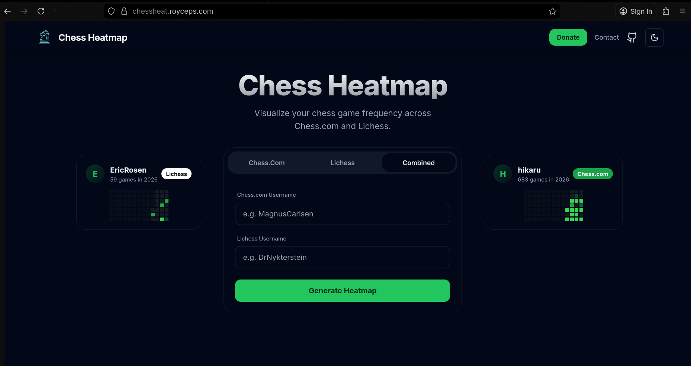
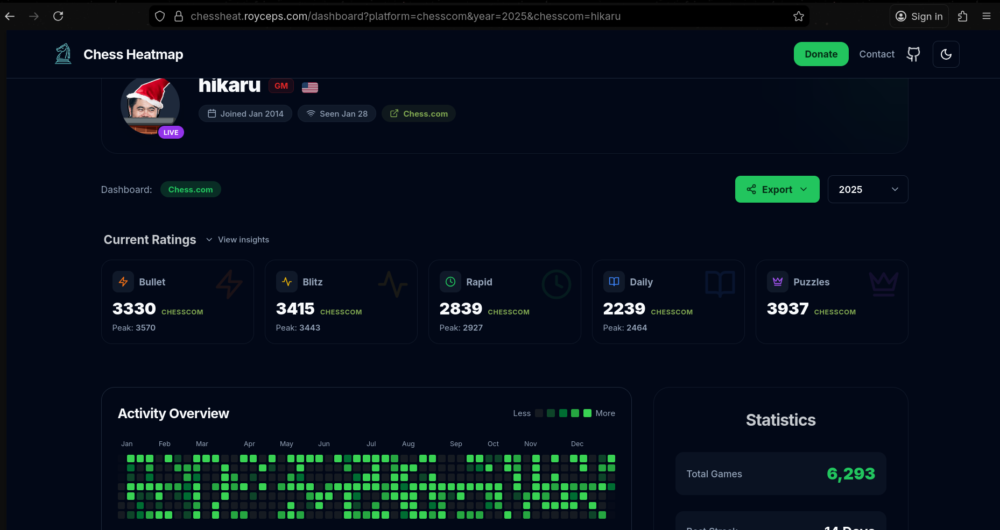

# Chess Heatmap 

Chess Heatmap visualizes your activity across Chess.com and Lichess in a single, unified view. It generates a year-long contribution graph that highlights your consistency and daily volume across both platforms.




The live application is available at: [https://chessheat.royceps.com](https://chessheat.royceps.com)

## Features

- **Unified Heatmap**: Merge game history from Chess.com and Lichess.
- **Detailed Statistics**: View daily game counts, win/loss rates, and streak data.
- **Platform Support**: Works with any public Chess.com or Lichess username.
- **Shareable Profiles**: Generate links to share your year in chess.
- **Mobile Friendly**: Fully responsive layout for phone and desktop.

## Tech Stack

- Next.js 14
- TypeScript
- Tailwind CSS
- Recharts

## Running Locally

1. Clone the repository:
   ```bash
   git clone https://github.com/royceps/chess-heatmap.git
   cd chess-heatmap
   ```

2. Install dependencies:
   ```bash
   npm install
   ```

3. Run the development server:
   ```bash
   npm run dev
   ```

## License

This project is licensed under the MIT License with the Commons Clause.

You are free to use, modify, and self-host this code for personal use.
You may not sell this software as a service or rebrand it as your own product.

See the `LICENSE` file for full details.

## Attribution

Created by [Royce](https://royceps.com).
If you use this code, please ensure the attribution link remains in the footer.
